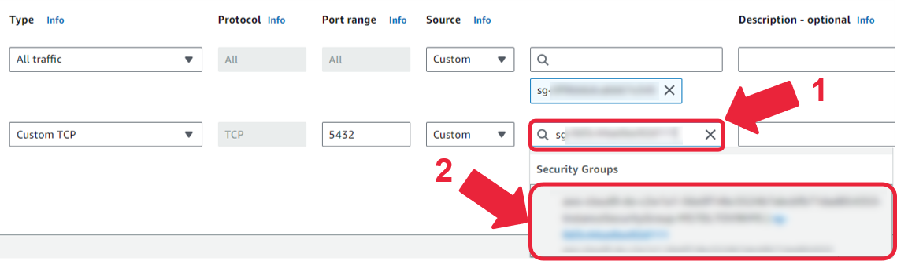

<link rel="stylesheet" href="style.css">

# Week 1 Assignment:<br>Troubleshooting Database Connectivity on AWS

In this lab, you will be tasked with troubleshooting and resolving common issues that could occur when connecting to a database. The assignment consists of several steps, including setting up the lab environment on AWS, addressing connectivity issues from an EC2 instance to an RDS instance, enhancing RDS security configurations, and finally, inserting data into the database and querying it. The lab guides you through debugging the connectivity issues while providing hands-on experience with AWS services and SQL.

# Table of Contents
- [1 - Fixing Database Connectivity Issues](#1)
- [2 - Fixing Permission Issues](#2)

---

<div id='1'/>

## 1 - Fixing Database Connectivity Issues

You are provided with an RDS instance to which you will try to connect from an EC2 instance.

1.1. To access the AWS console, run the following command in the terminal.
If necessary, open a new terminal by selecting Terminal > New Terminal from the menu.

```bash
cat ../.aws/aws_console_url
```
Open the link in the new browser window.

*Note*: For security reasons, the URL to access the AWS console will expire every 15 minutes, 
but any AWS resources you created will remain available for the 2 hour period. 
If you need to access the console after 15 minutes, please rerun the command to obtain a new active link.

*Note:* If you see the window like in the following printscreen, click on **logout** link, 
close the window and click on console link again.


1.2. Go to **RDS** in the AWS console and click on database instance `de-c2w1a1-rds` to see the details. Check the RDS Endpoint and Port, you may copy those values and save them locally.


1.3. Go to **EC2**. On the left panel, click on **Instances**.


1.4. You will see that there are already two EC2 instances provided to you. For the moment, you will work only with the 
one named `de-c2w1a1-external-bastion-host`.

- Click on the **Instance ID** for `de-c2w1a1-external-bastion-host`.
- On the upper panel, click on **Connect**.


- In the *EC2 Instance Connect* tab, click on **Connect**. You will be prompted to the EC2 instance terminal.


1.5. To connect to the RDS instance, the DevOps team gave you the following credentials to access the database:

- username: `postgres`
- password: `postgrespwrd`

The database is a PostgreSQL instance, so you need to install the `psql` client first; `psql` allows you to establish a connection to the PostgreSQL database. 
Execute the following command to install the `psql` client in the Amazon Linux 2 instance: 

```bash 
sudo amazon-linux-extras install postgresql10 -y
```

*Note*: In the EC2 terminal, depending on your browser and machine, the regular shortcuts for 
copying (`Ctrl+C` or `Cmd+C`) and pasting (`Ctrl+V` or `Cmd+V`) might not work. Instead, you can use
either `Ctrl + Insert` for copying with `Shift + Insert` for pasting or

`right-click` -> `copy` command,
`right-click` -> `paste` command.

1.6. Now you need to get the database endpoint. You can either use the endpoint you saved locally in step 1.2, or you get the endpoint by running the following command, replacing the `<PostgreSQL-DB-name>` with `de-c2w1a1-rds`:

``` bash
aws rds describe-db-instances --db-instance-identifier <PostgreSQL-DB-name> --output text --query "DBInstances[].Endpoint.Address" --region us-east-1
```

1.7. Try to connect to your RDS database by running the following command. Replace `<PostgreSQLEndpoint>` with the output from the previous step. The port 5432 is the default one for PostgreSQL, and the username and password are provided to you by the DevOps team.

*Note*: The following command will ask you to enter the database password. When you type in or paste the password, nothing will be actually shown on the screen - this is a security feature common in several terminal software.

```bash
psql --host=<PostgreSQLEndpoint> --username=postgres --password --port=5432
```

Pressing enter you will either get you an error or empty lines... the connection fails.


To exit the attempt press `Ctrl+C` (it also might be `Cmd+C` or `Ctrl+S`).

1.8. So.... the connection to the database failed. How can you troubleshoot the issue? Where should you start? Given what you know about networking, can you think of any problems that might be coming from the network setup you have for the EC2 instance and the database instance?

The RDS database instance resides inside a VPC (Virtual Private Cloud), and the EC2 instance, from which you attempted the connection, is also launched inside a VPC. Now, if the RDS database and EC2 instance are not launched inside the same VPC and the two VPCs are not configured to talk to each other, then this might be a reason why the connection failed. Let's check the VPC configuration of each.

Go to **RDS** in the AWS console, click on **Databases** and then click on the database instance `de-c2w1a1-rds`. Check the VPC under **Connectivity & Security**. Click on the **VPC** identifier and find the corresponding **VPC ID**. Click on the **VPC ID** and then check the Resource map associated with this networking configuration.

1.9. Open another tab and go to **EC2** in the AWS console. Click on **Instances** and then click on the **Instance ID** of the instance named `de-c2w1a1-external-bastion-host`. Then, scroll down and search for the **Networking** tab and click on it.


Check the **VPC** identifier (this is the VPC ID) and you can click on it to see the associated Resource map. You will realise that the RDS and the EC2 instances are launched in different VPCs, this is why they can't communicate: the EC2 instance was launched in a VPC named `de-c2w1a1-external-bastion-host-vpc` while the RDS instance was launched in another VPC named `de-c2w1a1`.

1.10. One solution could be to use an EC2 instance deployed in the same VPC as the RDS instance. However, in this lab, you don't need to do that because you are already provided with a second instance named `de-c2w1a1-bastion-host`, which is deployed in the correct VPC.

In the AWS console, go to **EC2**, and search for the **Instance ID** for the one named `de-c2w1a1-bastion-host`. 

*Optional*: You can check now that this EC2 instance is in the same VPC of your database (see steps 1.8-1.9).

1.11. Connect again to the new EC2 instance and test the connection to the database (repeat steps 1.5-1.7).

You will see that the connection still doesn't work. If you have the EC2 instance and the RDS both launched in the same VPC, why are you still unable to connect to the database? Is the RDS instance configured to receive traffic from the EC2 instance? How can you check?

So the second thing that you can check is the Security group of the RDS instance, to verify what incoming traffic is allowed to reach the RDS instance. Let's check it!

1.12. In the AWS console, search for **RDS**, go to **Databases** and then click on the database instance `de-c2w1a1-rds`. In the **Connectivity & security** section, click on the **VPC security groups** link. Then click on the **Security group ID** so you can check the Inbound rules.

You will see only one inbound rule, which allows `All traffic` but from the same security group. This means that any instance associated with the same security group can communicate freely with other instances in the same security group. The purpose of this default rule is to facilitate communication between resources within the same security group while maintaining a secure boundary from the resources outside the group. It's a convenient way to allow inter-instance communication within a specific context, such as within an application tier or across different components of a distributed system.

1.13. You know that the RDS database is a PostgreSQL database, and the default port allowed to establish communication to a PostgreSQL database is port `5432`. You need to add a new rule allowing traffic to that port. Click on the **Edit inbound rules** button, then **Add rule**. For type use `Custom TCP`, and for port range just use the port number `5432`. For source, you can choose `0.0.0.0/0` from the *Source* search list.


However, adding `0.0.0.0/0` as a source means allowing any public traffic to connect to the database. This is not the most secure way, but it might be a good and quick option to test the connection. The better practice is to only allow the required resources to connect to the database. At this moment, only the EC2 instance needs to access the database. So let's make sure to directly apply the better practice in this exercise.

- In another browser tab, search for **EC2** in the AWS console. Click on **Instances** and click on the **Instance ID** for `de-c2w1a1-bastion-host`. Go to the **Security** tab, and click on the **Security group** link. Copy **Security group ID**.

- Now go back to the tab where you were editing the inbound rule for RDS. In the *Source* field, paste the Security group ID you just copied and then click on the appearing Security Group in the dropdown.



Click on **Save rules**.

1.14. Go back to the EC2 instance and connect to the database again (repeat steps 1.5-1.7). You will now get the error similar to the following one:

```bash
psql: FATAL:  password authentication failed for user "postgres"
FATAL:  no pg_hba.conf entry for host "XX.X.X.XXX", user "postgres", database "postgres", no encryption
```

This error means that the provided password is incorrect. Assume you talked with the DevOps team: it turned out that they had to perform some maintenance and update your password to `adminpwrd` .

1.15. Try to connect again to the database using the new password, it should work now! Enter `\q` in the terminal to quit the connection.

Fantastic work! After a long time of debugging your RDS connection, you finally made it work!

<div id='2'/>

## 2 - Fixing Permission Issues

In this part of the lab, you will run some SQL statements to create a table inside the RDS database and populate it with some data from an S3 bucket.

2.1. Run the following command in the EC2 terminal to download the required files for the lab.

*Note*: Make sure to run all the commands of this section in the EC2 terminal, not the VSCode terminal.

```bash
aws s3 cp --recursive s3://dlai-data-engineering/labs/c2w1a1-814493-vocapi/ ./
```

2.2. You will now create a table in the database. Open the file `sql/ratings_table_ddl.sql` in the EC2 terminal with 
`nano -cv sql/ratings_table_ddl.sql` to inspect it without modifying it. Now that you have some experience with SQL, 
try to understand the code provided. To close the file just press `Ctrl + x` or `Cmd + x`.

2.3. Connect again to the database (step 1.7) and execute the SQL file with the following command:

```bash
\i sql/ratings_table_ddl.sql
```

**Expected output**:
```text
postgres=> \i sql/ratings_table_ddl.sql
psql:sql/ratings_table_ddl.sql:1: NOTICE:  table "ratings_training" does not exist, skipping
DROP TABLE
```

2.4. Run the query to check that the table is currently empty:

```sql
SELECT * FROM ratings_training;
```

2.5. Exit the database connection with the command `\q`.

2.6. The data that you need to ingest into the new database table exists in an S3 bucket that is provided to you in this lab. You can find the S3 bucket name in the AWS console, or by running one of the following commands `aws s3 ls` or

```bash
aws s3api list-buckets --output text --query "Buckets[].Name"
```

Save the result locally.

Let's download the data from the S3 bucket into a directory inside the EC2 instance. Create the directory `data`:

```bash
mkdir -p data
```

2.7. To download the file from the S3 bucket, you will use the Python script located at `scripts/download_from_s3.py`. Open the file and review its content. In the EC2 terminal open the file with `nano -c scripts/download_from_s3.py`. Replace the placeholder `<YOUR-DATA-BUCKET>` with the S3 bucket name that you found in the previous step. Once you have modified the file, press `Ctrl + o` or `Cmd + o`, and then press `Enter` to save the file. Close it with `Ctrl + x` or `Cmd + x`.

2.8. To run the script, you will need to install `boto3`:

```bash
pip3 install boto3
```

2.9. Now try to run the Python code with the following command:

```bash
python3 scripts/download_from_s3.py
```

You will get an error similar to this:

```bash
Error downloading file: An error occurred (403) when calling the HeadObject operation: Forbidden
```

This error message means that you do not have permission to download data from the S3 bucket.

2.10. In order to solve your issue, the DevOps team allowed you to add a bucket policy. This policy should be constrained to only your development environment in the EC2 instance and only to read from the folder where data is stored in the bucket (folder name is `csv`).

Go to the AWS console, search for **S3**, and click on your bucket name. Then, go to the **Permissions** tab and scroll down until you find the Bucket Policy section. Click on **Edit**.

2.11. Delete the provided policy and exchange it with the following policy:

```json
{
    "Version": "2012-10-17",
    "Statement": [
         {
            "Effect": "Allow",
            "Principal": "*",
            "Action": "s3:GetObject",
            "Resource": "arn:aws:s3:::<YOUR-BUCKET-NAME>/csv/*",
            "Condition": {
                "IpAddress": {
                    "aws:SourceIp": "<YOUR-BASTION-HOST-IP-ADDRESS>" 
                }
            }
         }
     ]
}
```

Replace the placeholders:
- `<YOUR-BUCKET-NAME>`: your S3 bucket name (see step 2.6),
- `<YOUR-BASTION-HOST-IP-ADDRESS>`: the Public IP address of the EC2 instance you are working on. Find **EC2** in the AWS console, click on **Instances**, and then on **Instance ID** link for the one named `de-c2w1a1-bastion-host`. Find and copy the **Public IPv4 address** from the **Instance summary** section.

Check the policy and try to understand it (for more information, you can check the [documentation](https://docs.aws.amazon.com/IAM/latest/UserGuide/reference_policies_elements_condition_operators.html#Conditions_IPAddress). This is a resource-based policy, make sure to check the reading materials of lesson 2 to learn more about this type of policy):

* `"Effect": "Allow"`: This means you allow certain actions to be performed over some resources.
* `"Action": "s3:GetObject"`: This specifies that the method `get_object` is allowed to be performed on the S3 bucket to get objects from it.

Make sure to save the changes you've made to the policy (click on **Save changes**). 

2.12. Repeat step 2.9 to download the data from the S3 bucket into the `data` folder that you created.

2.13. Explore the file `data/ratings_ml_training_dataset.csv` to understand the structure of the data. You can do it with the following command: 

```bash
head data/ratings_ml_training_dataset.csv
```

2.14. Open the `sql/copy_data.sql` file and explore the code. Remember to use the command `nano -cv sql/copy_data.sql` and close the file with `Ctrl + x` or  `Cmd + x`.

2.15. Then, connect to the database again (step 1.7) and populate the database using the following command:
    
```bash
\i sql/copy_data.sql
```

2.16. After this process, you should be able to query your table. You can use the knowledge you acquired in the lab of the previous course to explore the data. As a starting point, you can use the following query and also try to count the number of rows that have been inserted.

```sql
SELECT * FROM ratings_training LIMIT 10;
```