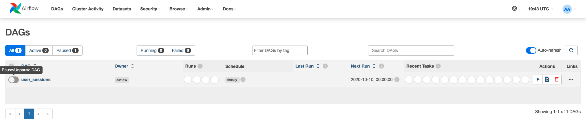

# Week 4 Lab 1:<br>Airflow 101 - Building your First Data Pipeline

In this lab, you will build your first DAG in Airflow using Python operators, 
visualize it in the Airflow UI and troubleshoot errors in the DAG. You will use a 
[dockerized](https://docs.docker.com/) version of Airflow running on an AWS EC2 
instance. 

To open the solution file, follow these steps:

- Go to the main menu and select `File -> Preferences -> Settings`.
- Click on `Text Editor` on the left, then scroll down to the `Files: Exclude` section.
- Remove the line `**/src_solution/**`. The folder will now appear in the explorer.
- You can close the `Settings` tab.

# Table of Contents
- [1 - Introduction](#1)
- [2 - The DAG Details](#2)
- [3 - Setting Up Airflow's Components](#3)
- [4 - Creating the DAG and its Tasks](#4)
    - [4.1 - Defining the DAG](#4-1)
        - [Exercise 1](#ex01)
    - [4.2 - Getting the Information of New Users per Date](#4-2)
        - [Exercise 2](#ex02)
    - [4.3 - Getting the Information of New Sessions per Date](#4-3)
        - [Exercise 3](#ex03)
    - [4.4 - Creating a Helper Function](#4-4)
        - [Exercise 4](#ex04)
    - [4.5 - Getting the Users' Information](#4-5)
        - [Exercise 5](#ex05)
    - [4.6 - Saving the Complete Sessions' Information](#4-6)
        - [Exercise 6](#ex06)
    - [4.7 - Cleaning Up the Temporary Files](#4-7)
        - [Exercise 7](#ex07)
    - [4.8 - Marking the DAG's End](#4-8)
        - [Exercise 8](#ex08)
    - [4.9 - Defining the DAG Dependencies](#4-9)
        - [Exercise 9](#ex09)
- [5 - Running Your DAG](#5)

<div id='1'/>

## 1 - Introduction

This week, you have learned about the basics of orchestration, what DAGs mean 
and how to build a simple DAG in 
[Apache Airflow](https://airflow.apache.org/docs/apache-airflow/stable/index.html). 
In this lab, you will implement your first data pipeline in Airflow and interact 
with its UI.

Assume you work as a Data Engineer at a fictitious company called 
_DeFtunes_, which is a new company in the music industry, offering a subscription-based app for streaming songs. Recently, they have expanded their services to include digital song purchases. With this new retail feature, DeFtunes requires a data pipeline to extract purchase data from their new API.

You are tasked to develop a pipeline to extract the users and sessions from the API to make data available for downstream systems' usage. 

To accomplish this task, you will create an Airflow-orchestrated 
pipeline that performs requests to the API to grab information about new users at a given date, about a user session at a given date, and the information of that user in the session. The pipeline will be scheduled to run every day.

<div id='2'/>

## 2 - The DAG Details

In this lab, you will implement the following DAG:


The DAG consists of the following tasks:

- `start`: an empty task marking the start of the DAG. It doesn't include any 
 behavior.

- `get_new_users`: sends a request to the 
 DeFtunes API to fetch 
 information about the users joining the platform in a particular date range. 
 In this task, you will save the returned information to a JSON file labelled 
 as `new_users_<LOGICAL_DATE>.json` stored in an S3 bucket. The `logical_date`, 
 in the name of the JSON file, represents the start of the data interval. 
  
- `get_session`: Gets data from the user sessions that have been created in a given date range. Those sessions can only be created by users who have already joined the platform. This will create a JSON file named `sessions_<LOGICAL_DATE>.json` stored in the same S3 bucket. This file is also temporary and will be deleted in the `cleanup` task.
  
- `get_user_info`: uses the user's ID stored in the 
  `sessions_<LOGICAL_DATE>.json` file to send the necessary requests to the API to fetch the complete user information of the user that started a particular session. In this task, you will save the returned users to a JSON file labelled as `users_info_<LOGICAL_DATE>.json` stored in an S3 bucket. This file is also temporary and will be deleted in the `cleanup` task.

- `save_complete_session`: uses information from the 
  `sessions_<LOGICAL_DATE>.json`, and `user_info_<LOGICAL_DATE>.json` files, 
 and the link to `cover_<LOGICAL_DATE>.jpg` to create 
 the final file contains the session and user information in one single JSON object. You will save the final file containing several sessions in a given date range to a JSON file labelled as 
  `complete_sessions_<LOGICAL_DATE>.json`stored in an S3 bucket.

- `cleanup`: deletes the intermediate files generated by the `get_session` and `get_user_info` tasks. The intermediate files are no longer needed after the creation of the complete session record.

- `end`: an empty task marking the end of the DAG. It doesn't include any behavior.

You will create the `start_task` and `end_task` using the 
[`EmptyOperator`](https://airflow.apache.org/docs/apache-airflow/stable/_api/airflow/operators/empty/index.html), 
and the rest of the tasks using the 
[`PythonOperator`](https://airflow.apache.org/docs/apache-airflow/stable/_api/airflow/operators/python/index.html).


> **Note:** For educational purposes, the proposed DAG uses `boto3` to interact 
with S3 and create/delete the necessary files. This is not desirable in 
real-life Airflow pipelines for the following two reasons:
>
> 1. Airflow should interact with storage and processing solutions using 
operators specifically designed for them (you can see the 
[documentation](https://airflow.apache.org/docs/apache-airflow-providers-amazon/stable/_api/airflow/providers/amazon/aws/operators/s3/index.html#airflow.providers.amazon.aws.operators.s3.S3FileTransformOperator)).
> 2. Airflow should only be an orchestrator, and it should delegate the 
actual processing workload of the pipeline to the appropriate tools such as 
databases or Spark clusters (Spark operators can be found 
[here](https://airflow.apache.org/docs/apache-airflow-providers-apache-spark/stable/operators.html)).

<div id='3'/>

## 3 - Setting Up Airflow's Components

First, you need to enter AWS console. Run the following command in the terminal.
If necessary, open a new terminal by selecting Terminal > New Terminal from the menu.

```bash
cat ../.aws/aws_console_url
```
Open the link in the new browser window.

*Note*: For security reasons, the URL to access the AWS console will expire every 15 minutes, 
but any AWS resources you created will remain available for the 2 hour period. 
If you need to access the console after 15 minutes, please rerun the command to obtain a new active link.

*Note:* If you see the window like in the following printscreen, click on **logout** link, 
close the window and click on console link again.


You are provided with a dockerized deployment of Airflow, already running on an 
EC2 instance. You will only interact with the Airflow UI and the DAG directory, 
which is an S3 bucket. 

3.1. To access your Airflow UI, go to the AWS console and search for 
**CloudFormation**. Click on the alphanumeric ID of the stack and search for the 
**Outputs** tab. You will see the key `AirflowDNS` with the complete URL to 
access the Airflow UI in the **Value** column. Copy it and paste it into another 
browser tab. You will see a login page, use the following credentials:

- username: `airflow`
- password: `airflow`

> **Note:** It might happen that you won't see a login screen straight away. 
As the Airflow's components deployment can take several minutes, it is possible 
that the first time you copy the URL, the service will not be yet available. You can 
continue working on the following exercises and refresh the Airflow UI 
tab in a few minutes to see the login screen.

In case your Apache Airflow environment presents any issues, follow these instructions to restart the service:

* In the scripts folder, you will see a script named `restart_airflow.sh`. Open it and copy its content.
* Search for **CloudShell** in the AWS console.
* Create a new file named `restart_airflow.sh`. You can do it with `nano -c restart_airflow.sh`.
* Paste the content in your clipboard into that file. Inside the nano editor, you can save and exit with `Ctrl + O` and `Ctrl + X` or `Cmd + O` and `Cmd + X`, depending on your OS.
* Run the script with:
 ```
 bash ./restart_airflow.sh
 ```

* This process will end when the service is healthy. That should take less than 3 minutes. Wait until the service has been restored. Then, go to your Airflow UI and refresh the browser's tab until you can see the UI Again.

3.2. In this lab, you will interact with two S3 buckets:

- _Raw Data Bucket_: this is the intermediate storage that you will use to 
 store the intermediate and final data collected by the pipeline (i.e., 
  `new_user_<LOGICAL_DATE>.json`, `sessions_<LOGICAL_DATE>.json`, `user_info_<LOGICAL_DATE>.json` 
 and `complete_sessions_<LOGICAL_DATE>.json`).
- _DAGs Bucket_: this is the DAG directory that you will use at the end of the 
 lab to upload the Python script defining your DAG. Airflow uses this directory 
 to recognise what DAGs you've created and enable you to visualize them in the 
 Airflow UI.
 Check the names of those two buckets in the 
 CloudFormation Outputs of the deployed stack.

<div id='4'/>

## 4 - Creating the DAG and its Tasks

To orchestrate this new feature to extract the information about users and sessions each 
day, you need to create, in a Python script, the Airflow DAG by defining its 
tasks using Airflow operators and clarifying their dependencies. The file 
`src/user_sessions.py` contains a partially defined DAG that you will complete 
in the following exercises.

Open the file `src/user_sessions.py`.

<div id='4-1'/>

### 4.1 - Defining the DAG

You first need to define some variables and instantiate your DAG.

<div id='ex01'/>

### Exercise 1

In the `user_sessions.py` file, search for the section associated with the 
`EXERCISE 1`. Complete the code replacing all `None` following the instructions 
in the code that contains the `### START CODE HERE ###` comment (3 sections). You will need to replace the placeholder `<RAW-DATA-BUCKET>` with
the name of the _Raw Data Bucket_. Also, you will set the `start_date` parameter 
to start seven (7) days before the provided date. The DAG `catchup` parameter is 
set to `True`, and choosing for `start_date` a previous date to the current date, 
Airflow will automatically run the DAG several times when you first activate it, 
to catch up on the missing runs.
Finally, just for the sake of simplicity, the parameter `end_date` has been set to `"2020-10-17"` and `max_active_runs` to 1.

<div id='4-2'/>

### 4.2 - Getting the Information of New Users per Date

In the first non-empty task of the DAG, you will fetch some initial information about new users, by sending a request to your provided API. 

The response from the API would look like as follows:

```json
[
 {
    "user_id": "<USER_ID>",
    "user_name": "<USER_NAME>",
    "user_lastname": "<USER_LASTNAME>",
    "user_location": [
      "<LATITUDE>",
      "<LONGITUDE>",
      "<PLACE_NAME>",
      "<TWO_LETTER_COUNTRY>",
      "TIMEZONE"
 ],
    "user_since": "<TIMESTAMP>"
 },
 {
    ...
 },
  ...
]
```

You will save this JSON string without any changes to the 
`new_users_<LOGICAL_DATE>.json` file in the _Raw Data Bucket_. 

<div id='ex02'/>

### Exercise 2

In the section marked as Exercise 2 of the `user_sessions.py` file, complete 
the definitions of the `get_new_users` function and the `get_new_users_task`. Go 
through the comments in the code to understand the meaning of the code lines. 
Then complete the code replacing all `None` with the correct value, by 
following the instructions in each code chunk starting with the comment 
`### START CODE HERE ###` (3 sections). You might find useful the documentation 
of the `boto3` client method 
[`put_object()`](https://boto3.amazonaws.com/v1/documentation/api/latest/reference/services/s3/client/put_object.html). Furthermore, for the API endpoint, search it in the *CloudFormation* Outputs under the `APIEndpoint` key.

> **Note**: what does the argument `context` that is passed into `get_new_users` 
function represent? Airflow has a set of 
[built–in variables](https://airflow.apache.org/docs/apache-airflow/stable/templates-ref.html) 
that contains information about the DAG that is currently running and its 
environment (like the DAG run's logical date). This information is stored in a 
dictionary called Airflow context, and for you to access it, you need to pass 
it to a task function. So `context` represents this dictionary that you can use 
to access the DAG run's logical date.

<div id='4-3'/>


### 4.3 - Getting the Information of New Sessions per Date

You are going to create a new task to extract the information for the new sessions, based on a date range. The response from the API would look like as follows:

```json
[
 {
    "user_id": "<USER_ID>",
    "session_id": "<SESSION_ID>",
    "session_items": [
 {
        "song_id": "<SONG_ID>",
        "song_name": "<SONG_NAME>",
        "artist_id": "<ARTIST_ID>",
        "artist_name": "<ARTIST_NAME>",
        "price": <PRICE>,
        "currency": "<CURRENCY>",
        "liked": <BOOLEAN_SONG_LIKED>,
        "liked_since": "<TIMESTAMP>"
 }
 ],
    "user_agent": "<USER_BROWSER>",
    "session_start_time": "<SESSION_TIMESTAMP>"
 },
 {
    ...
 },
  ...
]
```

You will save this JSON string without any changes to the `sessions_<LOGICAL_DATE>.json` file in the _Raw Data Bucket_. 

<div id='ex03'/>

### Exercise 3

In the section marked as Exercise 3 of the `user_sessions.py` file, complete 
the definition of the `get_session` function and the `get_session_task`. Complete the code 
replacing all `None` with the correct value, by following the instructions 
in each code chunk starting with the comment `### START CODE HERE ###` (3 sections). Remember to use the `APIEndpoint` Output from *CloudFormation* for the API endpoint.


<div id='4-4'/>

### 4.4 - Creating a Helper Function

Before you define the next tasks, you'll need to define a helper function that 
downloads the data from the file  `sessions_<LOGICAL_DATE>.json` that you 
have created in the `get_session` task. You will use this helper method in the 
subsequent tasks.

<div id='ex04'/>

### Exercise 4

In the section marked as Exercise 4 of the `user_sessions.py` file, complete 
the definition of the `get_session_info_dict` helper function. Complete the code 
replacing all `None` with the correct value, by following the instructions 
in each code chunk starting with the comment `### START CODE HERE ###` (2 sections).

<div id='4-5'/>

### 4.5 - Getting the Users' Information

In Exercise 3 where you extracted the session's information, you can notice that the only information about the user is the user identifier. In this task, you will extract the rest of the Users' information as it is required to have complete information about the users' sessions. You will use the `users_by_id` API endpoint for that. 

The response from the API will be the same as the response you got in the new user task. You will save this response to the `user_info_<LOGICAL_DATE>.json` file in the _Raw Data Bucket_. 

<div id='ex05'/>

### Exercise 5

In the section marked as Exercise 5 of the `user_sessions.py` file, complete 
the definitions of the `get_user_info` function and the `get_users_info_task` 
Airflow task. Replace all `None` with the correct value, by following the 
instructions in each code chunk starting with the comment `### START CODE HERE ###` (4 sections).

<div id='4-6'/>

### 4.6 - Saving the Complete Sessions' Information

In this task, you will use the information collected in the 
`sessions_<LOGICAL_DATE>.json` and `user_info_<LOGICAL_DATE>.json` files 
to create a set of records that will be kept to describe the complete sessions' information in a particular day. 


```json
[
 {
      "user_id": "<USER_ID>",
      "session_id": "<SESSION_ID>",
      "session_items": [
 {
          "song_id": "<SONG_ID>",
          "song_name": "<SONG_NAME>",
          "artist_id": "<ARTIST_ID>",
          "artist_name": "<ARTIST_NAME>",
          "price": <PRICE>,
          "currency": "<CURRENCY>",
          "liked": <BOOLEAN_SONG_LIKED>,
          "liked_since": "<TIMESTAMP>"
 }
 ],
      "user_agent": "<USER_BROWSER>",
      "session_start_time": "<SESSION_TIMESTAMP>",
      "user_name": "<USER_NAME>",
      "user_lastname": "<USER_LASTNAME>",
      "user_location": [
        "<LATITUDE>",
        "<LONGITUDE>",
        "<PLACE_NAME>",
        "<TWO_LETTER_COUNTRY>",
        "TIMEZONE"
 ],
      "user_since": "<TIMESTAMP>"
 },
 {
    ...
 },
    ...
]
```

You will save the final record to a file named 
`complete_sessions_<LOGICAL_DATE>.json` in the _Raw Data Bucket_.

<div id='ex06'/>

### Exercise 6

In the section marked as Exercise 6 of the `user_sessions.py` file, 
complete the definitions of the `save_complete_session` function and 
the `save_complete_session_task`. Replace all `None` following the instructions 
in each code chunk starting with the comment `### START CODE HERE ###` (3 sections).

<div id='4-7'/>

### 4.7 - Cleaning Up the Temporary Files

In this task, you will delete the temporary files as the yare no longer needed. 

<div id='ex07'/>

### Exercise 7

In the section marked as Exercise 7 of the `user_sessions.py` file, complete 
the definitions of the `clean_up_intermediate_info` function and the `cleanup_task`. 
Replace all `None` following the instructions in each code chunk starting with the comment `### START CODE HERE ###` (2 sections).

<div id='4-8'/>

### 4.8 - Marking the DAG's End

It is customary to mark the Airflow DAG's start and end with empty tasks. The 
`start_task` is already defined at the beginning of the task, but you must 
define the `end_task`.

<div id='ex08'/>

### Exercise 8

In the section marked as Exercise 8 of the `user_sessions.py` file, complete 
the definitions of the `end` task using an empty operator and settings for its 
ID to `"end"`.

<div id='4-9'/>

### 4.9 - Defining the DAG Dependencies

Now that you have defined all the tasks of your DAG, you now need to clarify 
their dependencies so that Airflow knows the appropriate order in which to run 
the pipeline's steps. Task dependencies are declared using the `>>` operator, 
with a statement like `A >> B` meaning that task `A` should be executed and 
finished before starting task `B`.

You need to define the dependencies among the tasks in such a way that Airflow 
recognizes the following DAG:


<div id='ex09'/>

### Exercise 9

In the section marked as Exercise 9 of the `user_sessions.py` file, define 
the dependencies between the tasks according to the desired DAG. 

You will need to use the variable names for the Operator objects 
(`start_task`, `get_new_users_task`, etc.). This is described in detail in the reading 
item "Best Practices in Writing Airflow DAGs" prior to this lab.

Save the changes made to the `user_sessions.py` file.

<div id='5'/>

## 5 - Running Your DAG

After you've finished all the exercises, you now have your DAG completely 
defined in `user_sessions.py`. To upload the `user_sessions.py` file into 
the DAG directory _DAGs Bucket_ (notice this is not the same bucket as the 
_Raw Data Bucket_), run the following command (replace `<DAGS-BUCKET>` with 
the name of your _DAGs Bucket_):

```bash
aws s3 sync src s3://<DAGS-BUCKET>/dags
```

>**Note:** You may be wondering the difference between the `aws s3 cp` and the 
> `aws s3 sync` commands, here are some differences:
>
> - The `aws s3 cp` command is used to copy individual files or entire directories 
> from a local file system to an S3 bucket, or vice versa. It copies files one 
> time, without considering whether the source or destination files have 
> been modified since the last copy operation.
> - On the other hand, the `aws s3 sync` is used to synchronize the contents 
> of a local directory with an S3 bucket or synchronize between two S3 buckets. 
> It compares the contents of the source and destination and only copies files that 
> are new or have been modified since the last sync operation. It also deletes 
> files in the destination that don't exist in the source.

After you synchronize your local `dags` folder with the S3 bucket folder, go to 
the Airflow UI, which you opened in step 3.1. You will see a list of the 
available DAGs, currently only one DAG should appear with the `user_sessions` 
identifier.

> **Note:** The DAGs list may take up to 5 minutes to refresh. If your DAG has 
> not appear immediately, click on the refresh button on the right-hand side 
> (just right the **Autorefresh** toggle) every 30 seconds or 1 minute.

You will also see on the left a toggle button to pause/unpause your DAGs.



Click on the toggle button to activate your DAG and then click on the DAG ID to 
go to the Grid view. Since the DAG has a start date in the past, Airflow should 
start its catchup process and perform the runs of the pipeline corresponding to 
the last few days. After a few seconds, all the missing runs should have been 
completed, have they?

Actually, you will see one of your tasks failing for all the runs. In the Grid 
view or Graph view, click on the failing task and search for the **Logs** tab. 
You will see some retries for the particular task and the logs for each of the 
attempts. Click on the last attempt's log and try to understand the issue.

You will see an output similar to this one:

```bash
82ff11a76678
*** Found local files:
***   * /opt/airflow/logs/dag_id=user_sessions/run_id=scheduled__2020-10-17T00:00:00+00:00/task_id=get_session/attempt=6.log
[2024-10-22, 19:48:45 UTC] {local_task_job_runner.py:123} ▶ Pre task execution logs
[2024-10-22, 19:48:45 UTC] {taskinstance.py:3310} ERROR - Task failed with exception
Traceback (most recent call last):
  File "/home/airflow/.local/lib/python3.11/site-packages/airflow/models/taskinstance.py", line 767, in _execute_task
    result = _execute_callable(context=context, **execute_callable_kwargs)
             ^^^^^^^^^^^^^^^^^^^^^^^^^^^^^^^^^^^^^^^^^^^^^^^^^^^^^^^^^^^^^
  File "/home/airflow/.local/lib/python3.11/site-packages/airflow/models/taskinstance.py", line 733, in _execute_callable
    return ExecutionCallableRunner(
           ^^^^^^^^^^^^^^^^^^^^^^^^
  File "/home/airflow/.local/lib/python3.11/site-packages/airflow/utils/operator_helpers.py", line 252, in run
    return self.func(*args, **kwargs)
           ^^^^^^^^^^^^^^^^^^^^^^^^^^
  File "/home/airflow/.local/lib/python3.11/site-packages/airflow/models/baseoperator.py", line 406, in wrapper
    return func(self, *args, **kwargs)
           ^^^^^^^^^^^^^^^^^^^^^^^^^^^
  File "/home/airflow/.local/lib/python3.11/site-packages/airflow/operators/python.py", line 238, in execute
    return_value = self.execute_callable()
                   ^^^^^^^^^^^^^^^^^^^^^^^
  File "/home/airflow/.local/lib/python3.11/site-packages/airflow/operators/python.py", line 256, in execute_callable
    return runner.run(*self.op_args, **self.op_kwargs)
           ^^^^^^^^^^^^^^^^^^^^^^^^^^^^^^^^^^^^^^^^^^^
  File "/home/airflow/.local/lib/python3.11/site-packages/airflow/utils/operator_helpers.py", line 252, in run
    return self.func(*args, **kwargs)
           ^^^^^^^^^^^^^^^^^^^^^^^^^^
  File "/opt/airflow/dags/user_sessions.py", line 119, in get_session
    assert response.status_code == 200, response.reason
           ^^^^^^^^^^^^^^^^^^^^^^^^^^^
AssertionError: Not Found
[2024-10-22, 19:48:45 UTC] {taskinstance.py:1225} INFO - Marking task as FAILED. dag_id=user_sessions, task_id=get_session, run_id=scheduled__2020-10-17T00:00:00+00:00, execution_date=20201017T000000, start_date=20241022T194845, end_date=20241022T194845
[2024-10-22, 19:48:45 UTC] {taskinstance.py:340} ▶ Post task execution logs
```

The error shows you that the status code of the API response is not 200, in other 
words, the requested endpoint was not found (i.e., a 404 status code). This 
means that there is an error in the requested URL you used in the `get_session` 
function. Open again the `user_sessions.py` file and 
search for the `get_session` function that throws the error. Search for the 
line where the API URL is built, it should look like this:

```python
response = requests.get(
            f"http://<API_ENDPOINT>/platform_sessions?start_date={start_date}&end_date={end_date}"
 )
```

Where `<API_ENDPOINT>` indicates the endpoint of your API. Although everything seems to be ok with that URL, you talked to the team that developed the API and they mentioned that there was a misunderstanding and the endpoint is simply `sessions` instead of `platform_sessions`, like this:

```python
response = requests.get(
            f"http://<API_ENDPOINT>/sessions?start_date={start_date}&end_date={end_date}"
 )
```

Once you implemented the changes to fix the error, sync again the folder with 
the S3 DAGs bucket with the command:

```bash
aws s3 sync src s3://<DAGS-BUCKET>/dags
```

Go back to your Airflow UI and click on the Airflow logo to return to the 
DAGs list. Click on the refresh button on the right, just above the DAGs list. 
Click again on your DAG ID and in the Grid view click on the failed task of the 
last run:


Then click on the **Clear task** button in the right panel.


In the pop-up tab, click on **Past** and you will see that the number of 
Affected Tasks will increase, meaning that you will run all of those failed 
tasks. Then click on **Clear** and all your failed tasks should start running.


When your tasks are retrying again, the grid view should look like the following:


Now, your DAG runs should run properly. If they didn't succeed use the logs 
to try to find the problem and go back to the `user_sessions.py` file to 
correct it. When you get successful runs, go to the _Raw Data Bucket_ (not the _DAGs Bucket_) 
to see if the appropriate JSON files were created. 

In this lab, you have practised building a DAG in Airflow using its basic 
operators. You now know how to build, monitor and debug your DAG in Airflow. 
In the next labs, you will learn more about Airflow operators and its other 
features, as well as the best practices in writing DAGs in Airflow.