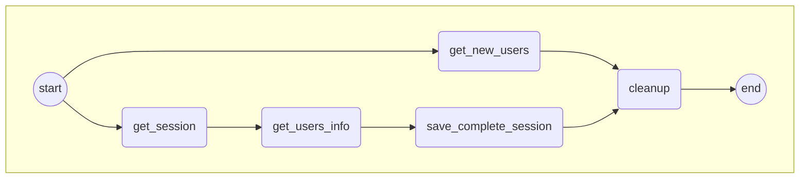

```mermaid
flowchart TD

subgraph Z[" "]
direction LR
    id1((start)) --> B(get_new_users)
    id1((start)) --> C(get_session)    
    B --> F(cleanup)
    C --> D(get_users_info)
    D --> E(save_complete_session)
    E --> F
    F --> id2((end))
end
    
```
