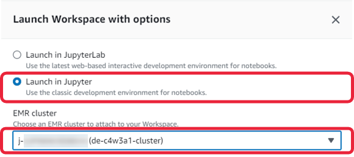

# Week 3 Assignment:<br>Data Transformations with Apache Spark

In this assignment, you will configure the EMR Studio environment to prepare for hands-on data transformation tasks using Apache Spark. 
Once the setup is complete, you’ll open and work within the notebook to explore Spark's powerful data processing capabilities.

# Table of Contents
- [1 - Setup the lab](#1)
- [2 - Lab content: Data Transformations with Apache Spark](#2)

---

<div id='1'/>

## 1 - Setup the lab

1.1. To access the AWS console, run the following command in the terminal.
If necessary, open a new terminal by selecting Terminal > New Terminal from the menu.

```bash
cat ../.aws/aws_console_url
```
Open the link in the new browser window.

*Note*: For security reasons, the URL to access the AWS console will expire every 15 minutes, 
but any AWS resources you created will remain available for the 2 hour period. 
If you need to access the console after 15 minutes, please rerun the command to obtain a new active link.

*Note:* If you see the window like in the following printscreen, click on **logout** link, 
close the window and click on console link again.


1.2. Go to **EMR**.


    
1.3. On the left panel, click on **Studios**


    
1.4. You will see a studio named `de-c4w3a1-studio-emr`, click on the **Studio Access URL**.


   
Another tab should have open, go to it.
   
1.5. In the **EMR Studio** click on **Workspaces** button on the left panel.


   
1.6. Click on  button to create a new workspace named `de-c4w3a1-studio-workspace`. The description you can leave blank. In the workspace storage you will see by default your bucket name and the `emr-studio` folder. You do not need to change that.
   

   
Click on  button.
   
*Note:* You may need to allow pop ups in your browser at this step, but you don't need to go to the new tab yet.

1.7. Workspaces do not attach to a cluster by default so when it appears with a ready status you will actually need to stop it. To do so, select your workspace, click on **Action** and then on **Stop**.


    
Click on refresh button  until you see that the workspace status is . Then, select the workspace again, click on **Launch Workspace** and then in **Launch with Options**. A pop up windows will appear. There, select the **Launch in Jupyter** option and select your cluster. 


    
The security groups will be filled by default. Click on . Wait until the workspace is ready again with the attached cluster:


*Note:* If you've got a message indicating that your browser does not allow pop ups, make sure to allow them or click again in the workspace name. If the link (from the workspace name) points to _.../workspace/**lab**?username=<user_id>=<user_name>_, make sure to change it to  _.../workspace/**tree**?username=<user_id>=<user_name>_.
        
1.8.  In the AWS console, go to **CloudShell**. 


1.9. Use the following two command lines to copy the `C4_W3_Assignment.ipynb` notebook to your own S3 bucket so it can be available in the EMR Studio Workspace: 

```bash
export ACCOUNT_ID=$(aws sts get-caller-identity --query Account --output text)
````
    
```bash
aws s3 cp s3://dlai-data-engineering/labs/c4w3a1-177787-vocapi/C4_W3_Assignment.ipynb s3://de-c4w3a1-$ACCOUNT_ID-us-east-1-emr-bucket/emr-studio/$(aws s3 ls s3://de-c4w3a1-$ACCOUNT_ID-us-east-1-emr-bucket/emr-studio --recursive | grep -o "e-[^/]*" | head -n 1)/C4_W3_Assignment.ipynb
```
    
You should see the following output before continuing:


1.10. Open the notebook `C4_W3_Assignment.ipynb` for this lab from the window popped up at the end of step 1.7. On the top-right corner of the opened notebook, select `PySpark` as kernel: go to **Kernel** in the menu bar, click on **Change kernel** and select **Pyspark**.


    
<div id='2'/>

## 2 - Lab content: Data Transformations with Apache Spark

2.1. Follow the instructions provided in the notebook *C4_W3_Assignment.ipynb* to complete the assignment.
