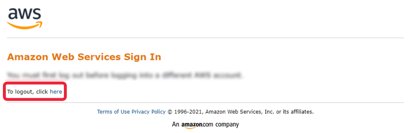
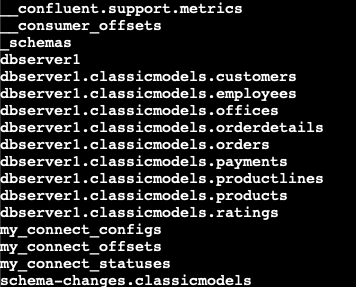

# Week 3 Lab:<br>Capture Data Change with Flink and Debezium

In this lab, you will implement a streaming pipeline with the intention of capturing data changes from a source system and delivering those changes in real time to a target system. 

To open the solution file, follow these steps:

- Go to the main menu and select `File -> Preferences -> Settings`.
- Click on `Text Editor` on the left, then scroll down to the `Files: Exclude` section.
- Remove the line `**/C4_W3_Lab_1_CDC_Solution.zpln`. The file will now appear in the explorer.
- You can close the `Settings` tab.

# Table of Contents
- [1 - Introduction](#1)
- [2 - CDC Infrastructure](#2)
- [3 - CDC Architecture Setup](#3)
    - [3.1 - Lab Setup](#3-1)
    - [3.2 - Zeppelin Interpreters](#3-2)
    - [3.3 - Debezium Configuration](#3-3)
- [4 - CDC Pipeline and Flink UI](#4)

---

<div id='1'/>

## 1 - Introduction

Change data capture (CDC) refers to a software process or design pattern that can detect changes to a source system (such as a database or data warehouse), as you can keep track of changes in near real-time, you can implement processes that achieve data consistency in data sources down the line of the source. 

A requirement has come through for your team to implement a CDC system from a source MySQL database to a target RDS database running Postgres. The rest of the team has set up a prototype of the architecture in an EC2 instance, the missing configuration and Flink pipeline have been left for you to develop and finally test the architecture.

<div id='2'/>

## 2 - CDC Infrastructure


The prototype has mostly been set up using a multi-container approach inside an EC2 instance, you can connect with the EC2 instance using an SSH tunnel. Here is a brief description of the components:

- **Source Database:** You already interacted with the source database in previous labs. For the prototype, the team set up a MySQL database inside a Docker container with the `classicmodels` database.

- **Debezium:** Distributed platform for CDC, it connects to the source system and captures the changes based on the configuration one setup. The UI has been provisioned with the `8080` port of the EC2 instance.

- **Apache Kafka:** The event streaming platform, has already been configured to connect with Debezium, based on your configuration in Debezium topics are created for each table that contains messages with each change. 

- **Apache Zookeeper:** Service that stores configuration information and allows the coordination of cloud applications. 

- **Apache Zeppelin:** Web-based notebook environment, it allows us to run Flink in a notebook alongside other possible interpreters. You can access the UI by connecting to the `8085` port of the EC2 instance, you can also see the Flink UI with the `8086` port.

- **Apache Flink:** Distributed processing engine for data streams, you will use it to connect to the Kafka topics and update the target database accordingly.

- **Target Database:** For the prototype, the team set up a Postgres database in an RDS instance with the target schema `classicmodels_star_schema`.

<div id='3'/>

## 3 - CDC Architecture Setup

<div id='3-1'/>

### 3.1 - Lab Setup

3.1.1. To access the AWS console, run the following command in the terminal.
If necessary, open a new terminal by selecting Terminal > New Terminal from the menu.

```bash
cat ../.aws/aws_console_url
```
Open the link in the new browser window.

*Note*: For security reasons, the URL to access the AWS console will expire every 15 minutes, 
but any AWS resources you created will remain available for the 2 hour period. 
If you need to access the console after 15 minutes, please rerun the command to obtain a new active link.

*Note:* If you see the window like in the following printscreen, click on **logout** link, 
close the window and click on console link again.



3.1.2. Navigate to the **CloudFormation** section in the AWS console, click on the alphanumeric stack name and search for the **Outputs** tab. Through the lab, you will need the values corresponding to the keys `ZeppelinUI`, `DebeziumUI`, `FlinkUI`, and `PostgresEndpoint`. 

<div id='3-2'/>

### 3.2 - Zeppelin Interpreters

Configure the interpreters to access the source and target database. In Apache Zeppelin, an interpreter is a plug-in that allows Zeppelin to run code in different languages, in your 
case it will allow us to run queries in Flink SQL, MySQL and Postgres.

3.2.1. Open a new tab and paste the `ZeppelinUI` URL to open the Zeppelin UI, it should look like this.


*Note:* If for any reason the `ZeppelinUI` or the `DebeziumUI` present any particular issue, you can restart the containers of the infrastructure by following these steps:

- In the AWS Console, search for EC2. In the left panel, click on **Instances**.

- Search for the instance named `de-c4w3lab1-work-instance` and click on the Instance ID.


- Click on **Connect**. Then in the **EC2 Instance Connect** tab, click on **Connect**.


Another browser tab will open; you will be logged inside the EC2 instance.

- Go to the `/kafka_debezium` folder with the following command:
        
    ```bash
    cd /kafka_debezium
    ```

- Execute the commands:
        
    ```bash
    sudo docker compose -f docker-compose-flink.yml down
    sudo docker compose -f docker-compose-flink.yml up -d
    ```

- Wait for around 1 to 2 minutes and then, execute the following command:
        
    ```bash
    curl -i -X POST -H "Accept:application/json" -H  "Content-Type:application/json" http://localhost:8083/connectors/ -d @conf/mysql_conf.json
    ```

- To check that the Debezium connection is ready, you can go to the `DebeziumUI` or run the command:
  
    ```bash
    sudo docker compose -f docker-compose-flink.yml exec kafka kafka-topics --bootstrap-server kafka:9092 --list
    ```   

You should see a list of Kafka topics as output, like in the following image:



3.2.2. Download locally lab notebook `C4_W3_Lab_1_CDC.zpln`. Then in the Zeppelin UI, click on **Import note**. In the pop-up window, click on **Select JSON file/IPYNB file** and search for the file you just downloaded, which is named `C4_W3_Lab_1_CDC.zpln`.


3.2.3. Once you have imported the notebook, you will be able to see it in the Zeppelin UI. Open it by clicking on it's name.


3.2.4. Go to the **anonymous** dropdown menu in the top right corner, click the menu and select the **Interpreter** link. You will be guided to the Interpreters page. Create on **Create** button on the top right of the new page, a form should appear like this one:


Fill in the new Interpreter name as `mysql` and select `jdbc` in the Interpreter group dropdown menu. Then in the properties, put the following values in the fields:
- **default.url:** `jdbc:mysql://mysql:3306/`
- **default.user:** `root`
- **default.password:** `debezium`
- **default.driver:** `com.mysql.jdbc.Driver`


Scroll down and in the **Dependencies** section, fill the first artifact field with the value `mysql:mysql-connector-java:8.0.28`, this will tell Zeppelin that it needs this JAR (package file for Java) to run 
the interpreter.


Click on **Save** button.

3.2.5. Add the Interpreter to connect to the target Postgres database. Click the Create button on the Interpreter's page again, the Interpreter name will be `psql` and the group `jdbc`.


Then in the properties, put the following values in the fields, replacing the placeholder `<POSTGRES_ENDPOINT>` with the value of the `PostgresEndpoint` output (make sure that you replace the whole placeholder, including the brackets `<>`):

- **default.url:** `jdbc:postgresql://<POSTGRES_ENDPOINT>:5432/postgres`
- **default.user:** `postgresuser`
- **default.password:** `adminpwrd`
- **default.driver:** `org.postgresql.Driver`

Finally, add the artifact `org.postgresql:postgresql:42.7.3` in the dependencies section. Finish by clicking on **Save** button.

<div id='3-3'/>

### 3.3 - Debezium Configuration

3.3.1. Open a new tab and paste the `DebeziumUI` URL from the CloudFormation outputs. This should show you the Debezium interface, where you can verify that the connection to the MySQL source database exists. You should see the following: 


<div id='4'/>

## 4 - CDC Pipeline and Flink UI

For the CDC Pipeline, you will create a simple star schema architecture based around the `classicmodels` orders. The target database has a schema named `classicmodels_star_schema` and the corresponding tables:

- **fact_orders**: A fact table based on the `orders` and `orderlines` tables. It contains information for each order item, the order itself, the product and the customer.
- **dim_customers**: A dimensional table based on the information for each client, based on the `customers` table.
- **dim_products**:A dimensional table based on the information for each product, based on the `products` and `productlines` tables.


4.1. Using Flink in the Zeppelin UI, you will implement the CDC pipeline to create and maintain the star schema. You can open the notebook by either clicking on **Zeppelin** icon in the top left corner or via the menu **Notebook**. Follow the instructions in the notebook `C4_W3_Lab_1_CDC.zpln`.

4.2 In order to access the Flink UI to see the running job, you can use the `FlinkUI` value from the CloudFormation Outputs. Take into account that the Flink UI won't be available until you execute any cell that starts with the magic command `%flink.ssql`.


In that UI, you will see that there are 4 available Task Slots. Each task slot represents a fixed subset of resources of the Flink TaskManager, so each time you execute a cell that requires processing a streaming of data, such as the `INSERT` statement shown before, a Task Slot will be in use. Make sure to follow the instructions in the `C4_W3_Lab_1_CDC.zpln` notebook to stop the necessary cells in order to free the Task Slots during the lab when required.